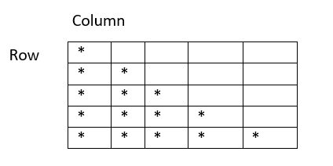

# star-pattern

###Pattern1
    
    

    | Tables        | Are           | Cool  |
    | ------------- |:-------------:| -----:|
    | col 3 is      | right-aligned | $1600 |
    | col 2 is      | centered      |   $12 |
    | zebra stripes | are neat      |    $1 |
    
    for row in range(num):
        for col in range(row):
            print("*",end=" ")
        print("\n")
        
        
        *
    
        * *
    
        * * *
    
        * * * *
    
        * * * * *

###Pattern2

        for row in range(num):
            for col in range(num-row):
                print("*",end=" ")
            print("\n")

    * * * * * *

    * * * * *

    * * * *

    * * *

    * *

    *

###Pattern3

            for row in range(num):
                for space in range(num-row):
                    print(" ", end=" ")
                for col in range(row):
                    print("*",end=" ")
        
                print("\n")

              *

            * *

          * * *

        * * * *

      * * * * *

###Pattern4
    
    for row in range(num):
        for space in range(row):
            print(" ", end=" ")
        for col in range(num-row):
            print("*", end=" ")
        print("\n")

    * * * * * *

      * * * * *

        * * * *

          * * *

            * *

              *

###Pattern5
    
    pattern1(num)
    pattern2(num)

    *

    * *

    * * *

    * * * *

    * * *

    * *

    *

###Pattern6
    
    pattern3(num)
    pattern4(num)

          *

        * *

      * * *

    * * * *

      * * *

        * *

          *

###Pattern7

     for row in range(num):
        for space in range(num-row):
            print(" ",end=" ")
        for col in range(row):
            print("*", end=" ")
            print(" ", end=" ")
        print("\n")

          *

        *  *

      *  *  *

###Pattern8

    for row in range(num):
        for space in range(row):
            print(" ", end="")
        for col in range(num-row):
            print("*", end=" ")
            print(" ", end=" ")
        print("\n")

   *   *   *   *

     *   *   *

      *   *

       *

###Pattern9

    pattern7(num)
    pattern8(num)

           *

        *   *

      *   *   *

    *   *   *   *

     *   *   *

      *   *

       *

###Pattern10

    for row in range(num):
        for space in range(num-row):
            print(" ",end=" ")
        for col in range(row):
            print("*", end=" ")
        for col in range(row+1):
            print("*", end=" ")
        print("\n")

            *

          * * *

        * * * * *

      * * * * * * *

###Pattern11

     for row in range(num):
        for space in range(row):
            print(" ", end=" ")
        for col in range(num-row):
            print("*",end=" ")
        for col in range(num-row-1):
            print("*",end=" ")

        print("\n")

     * * * * * * *

      * * * * *

        * * *

          *

###Pattern12

     pattern10(num)
     pattern11(num)

            *

          * * *

        * * * * *

      * * * * * * *

      * * * * * * *

        * * * * *

          * * *

            *

